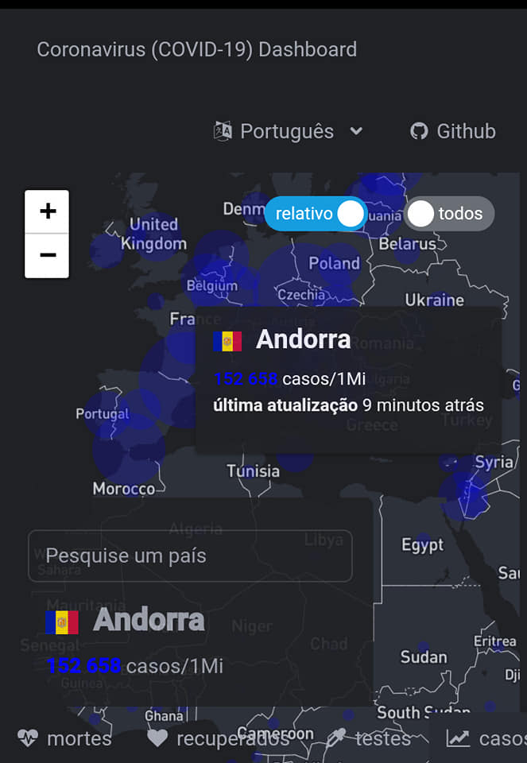
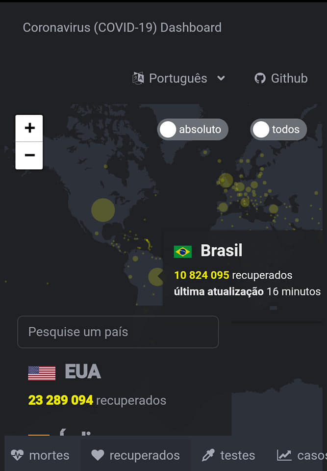

<h1 align="center">
  🦠 Painel de Estatísticas do COVID-19 😷
</h1>

<h3 align="center">
  Um aplicativo de mapeamento que usa uma API contendo estatísticas recentes do Coronavirus e mapeia os locais e o impacto que cada país está enfrentando.
</h3>

  
  
  

<h4 align="center">
	🚧   Em construção... 🚀 🚧
</h4>

  <a href="#-objetivo">Objetivo</a> •
  <a href="#-funcionalidades">Funcionalidades</a> • 
  <a href="#-tecnologias">Tecnologias</a> • 
  <a href="#-autor">Autor</a> •
  <a href="#-licenc-a">Licença</a> 

## 💻 Objetivo

Um painel de mapa que mostra estatísticas e informações geográficas sobre COVID-19.

Lidar com uma pandemia global significa que vírus como o Coronavirus impactam o mundo de forma diferente com base na localização geográfica.

Ter um mapa com uma análise das estatísticas de cada país é uma maneira útil de ser capaz de determinar coisas como quais países foram afetados mais.

[Acesse o website](https://coronavirus-map-dashboard.herokuapp.com)!

## ⚙️ Funcionalidades

- [x] Traduções em 4 idiomas
  - [x] Inglês
  - [x] Português
  - [x] Francês
  - [x] Alemão
- [x] Filtros de dados
  - [x] Casos
  - [x] Recuperados
  - [x] Mortos
  - [x] Testes 
- [x] Filtro de tipo de dados 
  - [x] Relativos
  - [x] Absolutos
- [x] Filtrar por dia de hoje  
- [ ] Mostrar dados globais
- [ ] Clique no ranking de países dar zoom no local do país

## 🛠 Tecnologias

As seguintes ferramentas foram usadas na construção do projeto:

- [React](https://pt-br.reactjs.org/)
- [Axios](https://axios-http.com)
- [RSuite](https://rsuitejs.com)
- [React Leaflet](https://react-leaflet.js.org)
- [disease.sh](https://disease.sh)
- [Mapbox](https://www.mapbox.com)

## 🎨 Layout

O layout da aplicação em dois tamanhos de tela:

### Mobile

  

  

### Web

  

## 🦸 Autor

 
 
 

## 📝 Licença

Este projeto esta sobe a licença [MIT](./LICENSE).

Feito com ❤️ por Felipe Alves 👋🏽 [Entre em contato!](https://www.linkedin.com/in/felipe-alves-90349a208/)
